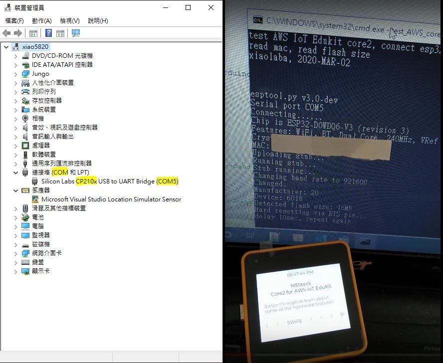
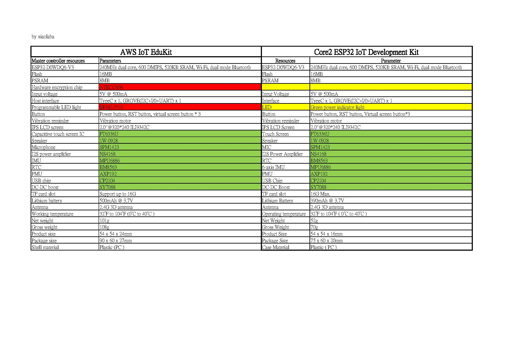

# ESP32_AWS_IoT_EduKit_quick_test
batch file for windows, before doing this, install Arduino IDE &amp; esp32core to get the esptool.exe ready in your PC. or just uses this local copy here, [esptool.exe](esptool.exe).    

connect AWS IoT EduKit core2 to PC USB, find the com port number with DEVICE manager, WIN10 will install the driver of CP210x automatically.  

Mine is COM5, you may have other difference, change COM5 to whatever that match yours.  
  


the test clip,  
https://youtu.be/3nAwNWibKuM 


the batch file,  


```
:: To erase esp32 completely, do not rely on Arduino IDE and code upload, it has cluster and odd thing when uses FATFS, 
:: unless format SPIFFS or FATFS everytime on the fly
:: xiaolaba, 2020-MAR-02
:: Arduino 1.8.13, esptool and path,


cls
@echo test AWS IoT Edukit core2, connect esp32 to PC
@echo read mac, read flash size
@echo xiaolaba, 2020-MAR-02
@echo.


@echo off

set comport=COM5
set esptoolpath="C:\Users\user0\AppData\Local\Arduino15\packages\esp32\tools\esptool_py\3.0.0/esptool.exe"
set project=FTBserver


set action=%esptoolpath% --chip esp32 ^
--port %comport% ^
--baud 921600 ^
read_mac

@echo.
 
::%esptoolpath% --chip esp32 --port %comport% --baud 921600 ^
::read_mac

:::: ESP32 has no chip_id, read_mac instead
::@echo.
::%esptoolpath% --chip esp32 --port %comport% --baud 921600 ^
::chip_id >> esp32_info.txt

@echo.

%esptoolpath% --chip esp32 --port %comport% --baud 921600 ^
flash_id


:: erase whole flash of esp32
::%esptoolpath% --chip esp32 ^
::--port %comport% ^
::--baud 921600 ^
::erase_flash

::pause

@echo delay 10sec, repeat again
timeout 10 >nul
test_AWS_core2_esp32.bat


```


### Harware Specification  

Accordingly to M5Stack, the design and speciaifcation of AWS kit & Core2 kit  
https://shop.m5stack.com/products/m5stack-core2-esp32-iot-development-kit-for-aws-iot-edukit  
https://shop.m5stack.com/collections/m5-core/products/m5stack-core2-esp32-iot-development-kit  

it is simply the cross reference to each except a few of minor difference. see the table rearranged as conclusion, chipset used is almost identical & numbers.  

  


### Schematic  
~~AWS kit has no schematic provided so far, but core2 kit has opened the schematic is avaialble~~,  
see this https://docs.m5stack.com/en/core/core2,  
see this https://docs.m5stack.com/en/core/core2_for_aws,  
it is reasonable assumption to see the design and cirtuit almost 99% identical and could be good reference and starting point.  

AWS kit,  
local copy   
local copy   

core2 kit,  
local copy   
local copy   

### ESP32 datasheet  
this is ESP32 data sheet, https://www.espressif.com/sites/default/files/documentation/esp32_datasheet_en.pdf  
  
local copy   
    

